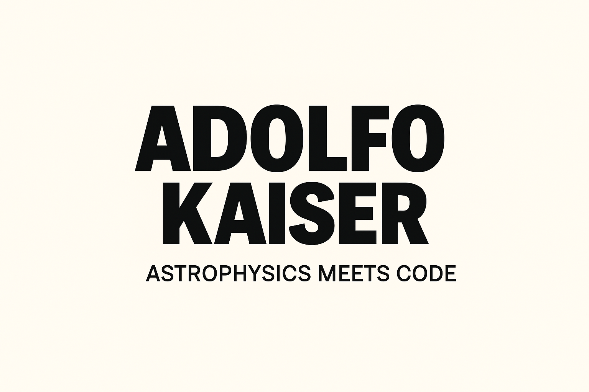

  

<h1 align="center">
  👋 Hi, I'm Adolfo
</h1>

  🎓 Physicist | 🐍 Python Dev: Data Science, Automation Bots & Astrophysics | 📊 Fuel Pricing Automation @ BP  | 🔭 Exoplanet Hunter in Training  

---

  
  

### 🧰 Skills

- **Languages & Databases**: Python, SQL (SQL Server, SSMS)  
- **Data & ML Tools**: Pandas, NumPy, Scikit-learn, TensorFlow, Keras, Matplotlib, Seaborn  
- **Automation & Scripting**: Selenium, xlwings, win32com, Pyperclip, JSON, OS, Sys, Re, Pathlib, Urllib3, Schedule  
- **Astrophysics Libraries**: Lightkurve, Astropy, Batman, TransitLeastSquares  
- **Trading & Financial Tools**: MetaTrader 5 (MT5), TA-Lib  
- **Dev Environments**: VSCode, Cursor, Power BI  
- **Other**: GitHub Projects, README writing, technical documentation

---

### 🚀 Highlighted Projects

- 🏢 `bp-pricing-automation`  
  End-to-end automation of BP Mexico's fuel pricing workflow using Python (Selenium, OCR, GUI, Excel) and Power BI.  
  Includes 13 dashboards for strategy analysis, margin control, and competitive benchmarking.

- 🛰️ `exoplanet-transit-injection`  
  Transit injection–recovery pipeline for validating planet detection methods with TESS data.

- 🧠 `rack-price-predictor`  
  Neural network to predict Pemex TAR prices using multi-product fuel data, Brent & WTI benchmarks, and regional trends.

- 📉 `forex-scalping-lstm`  
  Algorithmic trading bot using LSTM for high-frequency EUR/USD scalping.

---

### 📫 Contact

- 📍 Mexico City  
- 📧 adolfokaiser@ciencias.unam.mx
- 🔗 [LinkedIn](https://linkedin.com/in/adolfokaiser)

---

  🧪 <i>Currently building my portfolio and always open to collaboration!</i>

